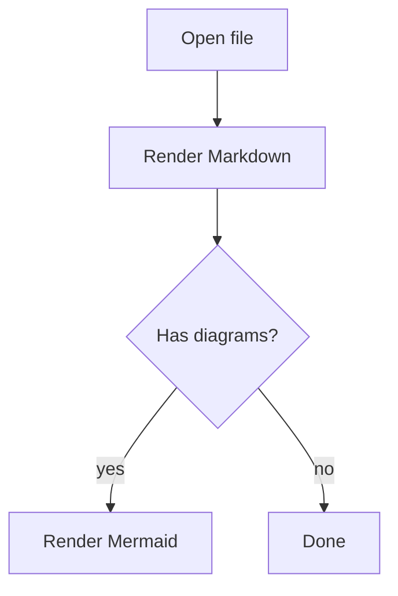

# markdownviewer demo

This is a small file you can use to test the viewer.

## Formatting

- **bold**
- *italic*
- `inline code`
- ~~strikethrough~~

### Task list

- [x] done
- [ ] not done

## Code block

```rust
fn main() {
    println!("Hello from markdownviewer!");
}
```

## Table

| key | value |
| --- | ----- |
| viewer | GUI |
| reload | **Reload** button |

## Callouts

> [!NOTE]
> This is a note callout.

> [!WARNING]
> This is a warning callout.

## Footnote

This has a footnote.[^1]

[^1]: Here is the footnote.

## Definition list

Term
: Definition

## Math

Inline: $E = mc^2$

Block:

$$
\int_0^1 x^2 \, dx = \frac{1}{3}
$$

## Mermaid



## Emoji + Links

Emoji: :rocket: :sparkles:

Autolinks: https://example.com and www.rust-lang.org
